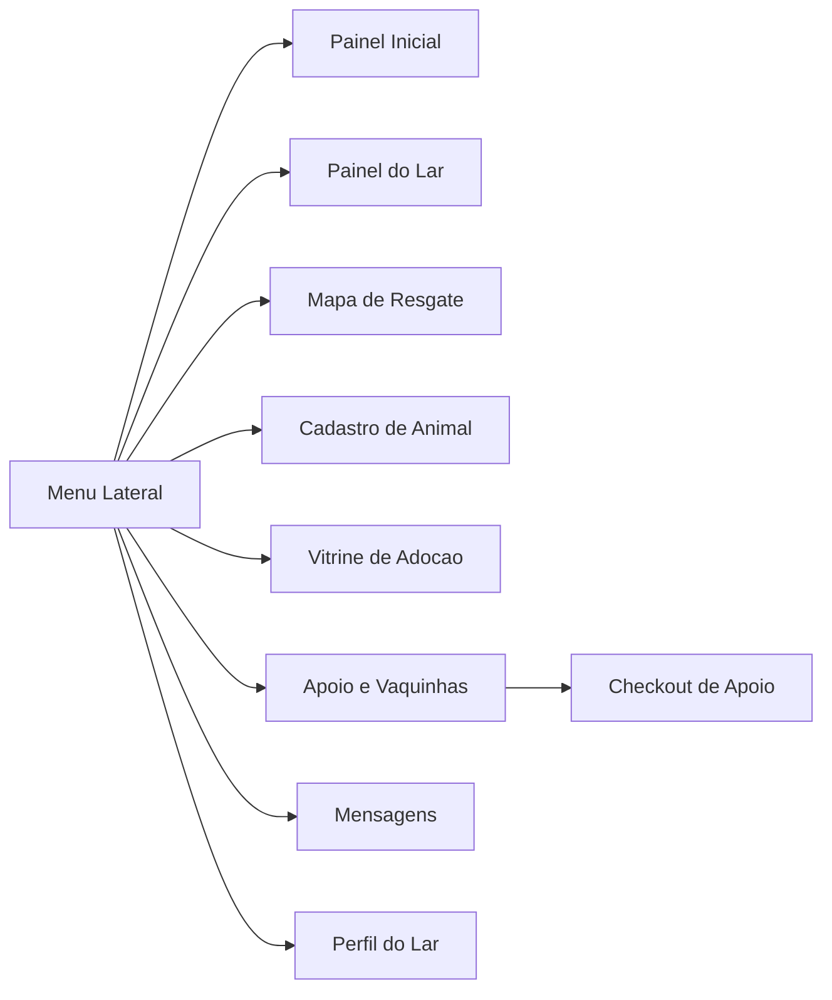
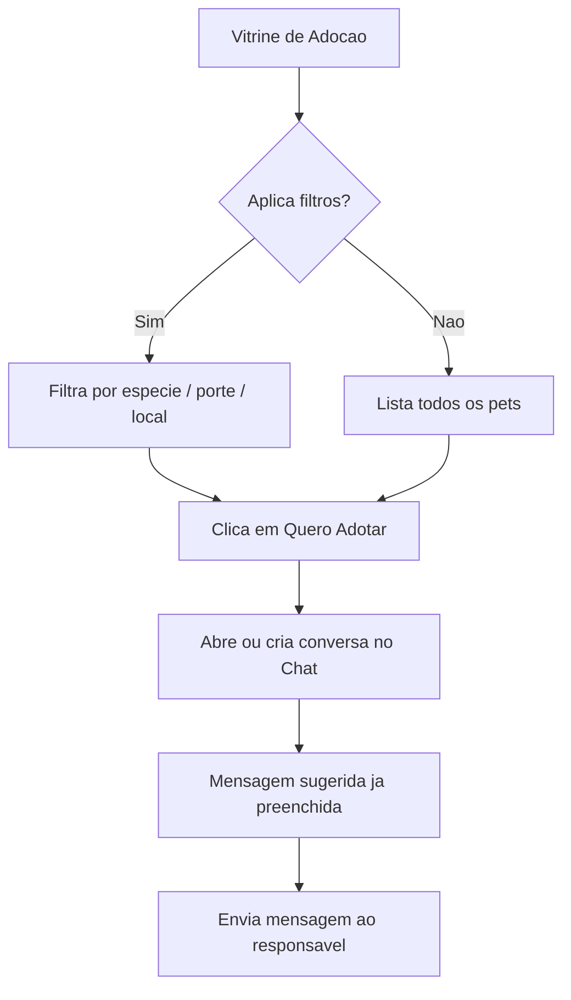
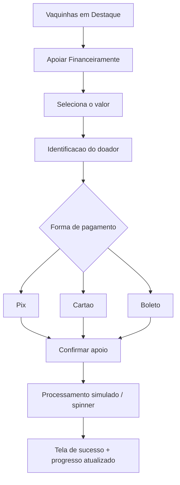
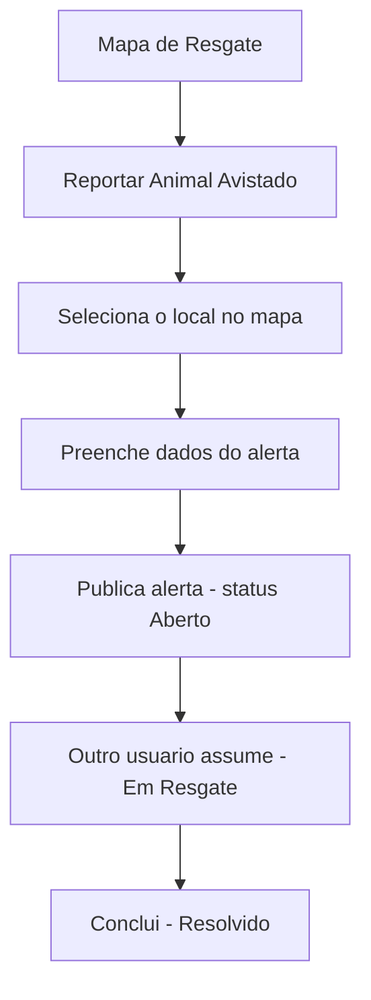

# Documentação do Projeto — Salva Patas

> Documento de requisitos, decisões de projeto e descrição técnica.
> Disciplinas: **Mentalidade Criativa e Empreendedora** e **Front-End**.

🔗 **Aplicação:** https://gabiimarotti.github.io/salva-patas/

---

## 1. Visão geral

O **Salva Patas** é uma plataforma web que conecta os diferentes atores envolvidos na causa animal — adotantes, doadores, ONGs, lares temporários e protetores independentes — em um único ambiente. O objetivo é reduzir a fragmentação atual (grupos de WhatsApp, posts soltos em redes sociais) e oferecer uma experiência organizada para adotar, doar, resgatar e acompanhar animais em situação de vulnerabilidade.

A aplicação foi construída como **SPA (Single Page Application)**: existe um único arquivo HTML carregado uma vez, e a navegação entre as nove telas acontece via JavaScript, alternando a visibilidade de blocos (`.page-view`) sem recarregar a página.

## 2. Problema e público-alvo

**Problema:** as informações sobre adoção, resgate e doação para animais de rua estão dispersas e desorganizadas, dificultando que quem quer ajudar encontre como ajudar, e que ONGs e protetores ganhem visibilidade.

**Público-alvo:**
- Pessoas que desejam **adotar** um animal de forma responsável.
- Pessoas que querem **doar** dinheiro ou insumos (ração, medicamentos, cobertores).
- **ONGs e lares temporários** que precisam gerir hospedagens e divulgar campanhas.
- **Protetores independentes** que resgatam e cuidam de animais de rua.

## 3. Objetivos

- Centralizar adoção, doação, resgate e comunicação em uma única plataforma.
- Dar visibilidade às campanhas de arrecadação (vaquinhas) e às necessidades de insumos.
- Permitir o mapeamento geográfico de animais que precisam de resgate.
- Oferecer um canal direto de comunicação entre adotante e responsável pelo animal.

## 4. Requisitos / Recursos

### 4.1 Requisitos funcionais

| ID | Requisito |
|----|-----------|
| RF01 | Navegar entre os módulos sem recarregar a página (SPA) |
| RF02 | Exibir painel inicial com dicas, casos de sucesso e mural de avisos |
| RF03 | Cadastrar animal com foto, dados e tags de saúde automáticas |
| RF04 | Listar animais para adoção com filtros (espécie, porte, localização) |
| RF05 | Iniciar conversa de adoção a partir da vitrine |
| RF06 | Exibir mapa interativo com alertas de resgate georreferenciados |
| RF07 | Reportar um novo animal avistado selecionando o local no mapa |
| RF08 | Atualizar o status de um alerta (Aberto → Em Resgate → Resolvido) |
| RF09 | Criar e exibir vaquinhas com barra de progresso de arrecadação |
| RF10 | Apoiar uma vaquinha financeiramente (Pix, Cartão ou Boleto — simulado) |
| RF11 | Solicitar/registrar insumos no mural de necessidades |
| RF12 | Trocar mensagens em um chat com filtros e busca |
| RF13 | Editar o perfil do lar e controlar a capacidade de vagas |

### 4.2 Requisitos não funcionais

| ID | Requisito |
|----|-----------|
| RNF01 | Interface responsiva (desktop e mobile), com menu lateral em drawer no celular |
| RNF02 | Feedback visual constante (toasts, spinners de carregamento, animações) |
| RNF03 | Aplicação 100% estática, sem necessidade de servidor ou banco de dados |
| RNF04 | Carregamento rápido, sem etapa de build |
| RNF05 | Hospedagem gratuita e deploy simples (GitHub Pages) |

### 4.3 Descrição dos módulos

- **Painel Inicial:** banner de boas-vindas, carrossel horizontal de dicas para lares temporários, casos de sucesso e mural de avisos da comunidade.
- **Painel do Lar:** três indicadores (hospedados ativos, adotados, vaquinhas), abas de "Animais Hospedados" e "Histórico de Adoções", e modais para criar vaquinha e gerenciar insumos.
- **Mapa de Resgate:** mapa Leaflet centrado em Maringá-PR, com marcadores coloridos por categoria (Urgente, Alimentação, Abandono, Perdido), lista lateral de alertas com distância calculada (fórmula de Haversine) e fluxo de status do resgate.
- **Cadastro de Animal:** formulário com upload de imagem (pré-visualização via `FileReader`), checkboxes de saúde que geram tags automaticamente e imagem de fallback por espécie quando não há foto.
- **Vitrine de Adoção:** grid de cards com filtros por localização, espécie (radio) e porte (botões), e botão "Quero Adotar" que abre o chat.
- **Apoio e Vaquinhas:** vaquinhas em destaque com barra de progresso e mural de insumos físicos.
- **Checkout de Doação:** seleção de valor (pré-definido ou customizado), identificação do doador, abas de pagamento (Pix com QR Code em SVG, Cartão e Boleto), spinner de processamento e tela de sucesso animada que atualiza o progresso da campanha.
- **Mensagens:** lista de contatos com filtros (Todos / Demonstrei Interesse / Entraram em Contato) e busca, janela de conversa com balões, e resposta automática simulada do interlocutor.
- **Perfil do Lar:** edição de dados do lar e barra de capacidade de vagas que recalcula em tempo real; ao renomear o lar, a mudança propaga para todos os animais vinculados.

## 5. Arquitetura e fluxos

A aplicação não tem backend. Todo o estado vive em **arrays JavaScript em memória** (`pets`, `alertas`, `vaquinhas`, `conversas`, `adotados`, `insumosMural`), e as telas são renderizadas dinamicamente por funções `render*()`.

### 5.1 Navegação (SPA)



### 5.2 Fluxo de adoção



### 5.3 Fluxo de doação / apoio



### 5.4 Fluxo de resgate



## 6. Decisões de layout e interface

- **Padrão dashboard (sidebar + conteúdo):** escolhido por ser o layout mais reconhecível para uma plataforma de gestão. A barra lateral fixa dá acesso constante aos módulos e comunica que o Salva Patas é uma ferramenta, não apenas um site institucional.
- **Paleta de cores:** derivada da logo. Violeta/roxo (`#8b5cf6`) como cor primária, índigo escuro (`#1e1b4b`) na sidebar, e cores de apoio para status (vermelho = urgência, amarelo/laranja = atenção, verde = sucesso). As cores são centralizadas em **CSS Variables** (`:root`), o que facilita manutenção e troca de tema.
- **Tipografia:** fonte **Inter**, sans-serif moderna e de alta legibilidade em telas, muito usada em interfaces de produto.
- **Cards arredondados e sombras suaves:** transmitem leveza e modernidade, alinhados ao tom acolhedor da causa animal.
- **Feedback imediato:** toasts de confirmação, spinners durante "processamentos" e animações de entrada (`fadeIn`, `scaleUp`) deixam claro ao usuário que cada ação teve efeito.
- **Responsividade:** em telas até 768px a sidebar vira um *drawer* com overlay, os grids colapsam para uma coluna e o chat alterna entre lista de contatos e conversa, replicando o comportamento de apps de mensagem.

## 7. Tecnologias e justificativa da stack

| Tecnologia | Por que foi escolhida |
|---|---|
| **HTML5 + CSS3 puro** | Demonstra domínio dos fundamentos de front-end (objetivo da disciplina). CSS Variables, Flexbox e Grid dão todo o controle de layout sem dependências. |
| **JavaScript Vanilla (ES6)** | Para uma aplicação deste porte, um framework (React/Angular) adicionaria build, dependências e complexidade sem ganho real. O JS puro mantém o projeto leve e transparente. |
| **Leaflet + OpenStreetMap** | Biblioteca de mapas leve, open-source e gratuita, ideal para o módulo de resgate georreferenciado. |
| **Font Awesome** | Iconografia consistente e amplamente reconhecida, via CDN. |
| **Google Fonts (Inter)** | Tipografia profissional sem custo e fácil de integrar. |
| **GitHub Pages** | Hospedagem gratuita, integrada ao repositório. Como o projeto é estático e sem build, o deploy é trivial: basta o push na branch e ativar o Pages. |

> **Decisão consciente — não usar Bootstrap nem frameworks:** optou-se por escrever o próprio design system em CSS puro. Isso evidencia o aprendizado dos fundamentos e elimina o peso de bibliotecas que não seriam totalmente aproveitadas.

## 8. Estrutura de pastas

```
salva-patas/
├── index.html              # Estrutura HTML de todas as telas
├── README.md
├── assets/
│   ├── css/style.css       # CSS extraído do <style>
│   ├── js/app.js           # Lógica extraída do <script>
│   └── img/logo.jpeg
└── docs/
    ├── documentacao.md     # Este documento
    └── img/                # Imagens dos diagramas (opcional)
```

## 9. Hospedagem e deploy

A aplicação está publicada via **GitHub Pages** em https://gabiimarotti.github.io/salva-patas/.

Processo de deploy:
1. `push` dos arquivos para a branch principal do repositório.
2. Em **Settings → Pages**, definir a branch e a pasta raiz como fonte.
3. O GitHub gera a URL pública automaticamente; cada novo `push` atualiza o site.

## 10. Limitações conhecidas e próximos passos

São limitações esperadas por se tratar de um protótipo de front-end, e bons pontos a comentar na apresentação:

- **Persistência:** o estado fica apenas em memória. Ao recarregar a página, os dados voltam ao estado inicial. Próximo passo: integrar `localStorage` ou um backend (ex.: Firebase).
- **Pagamentos:** o checkout (Pix/Cartão/Boleto) é **simulado**, sem gateway real.
- **Autenticação:** não há login real; o "lar" logado é fixo para fins de demonstração.
- **Dados de exemplo:** alguns campos vêm pré-preenchidos com dados fictícios apenas para facilitar a demonstração.

Evoluções futuras: autenticação de usuários, backend com banco de dados, gateway de pagamento real e notificações.

---

_Documento mantido no repositório do projeto, em `docs/documentacao.md`._
